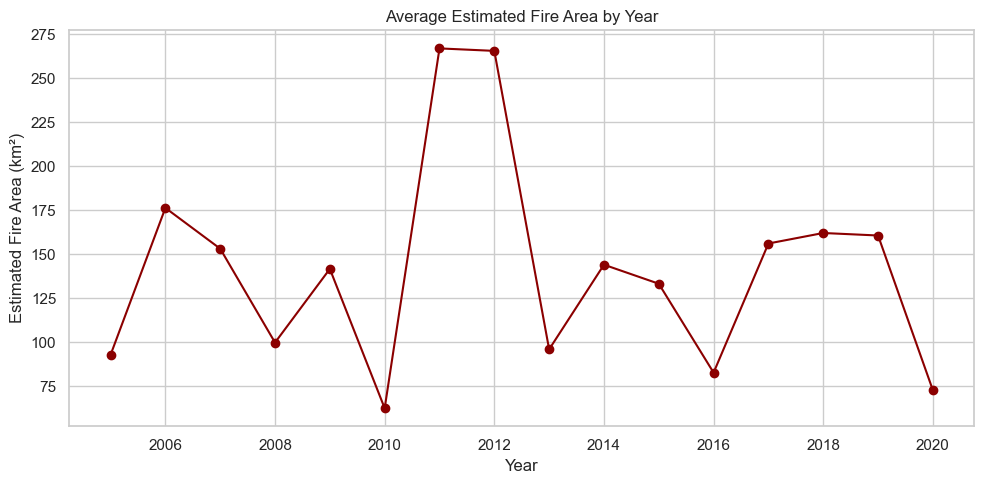
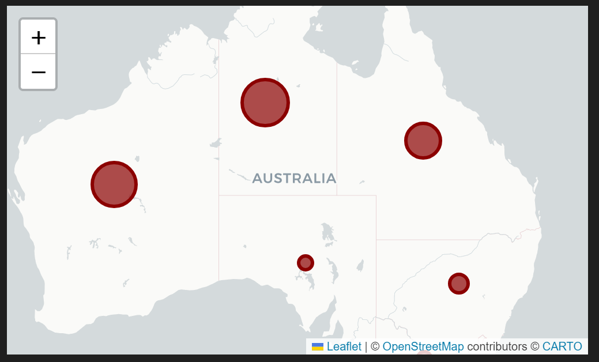
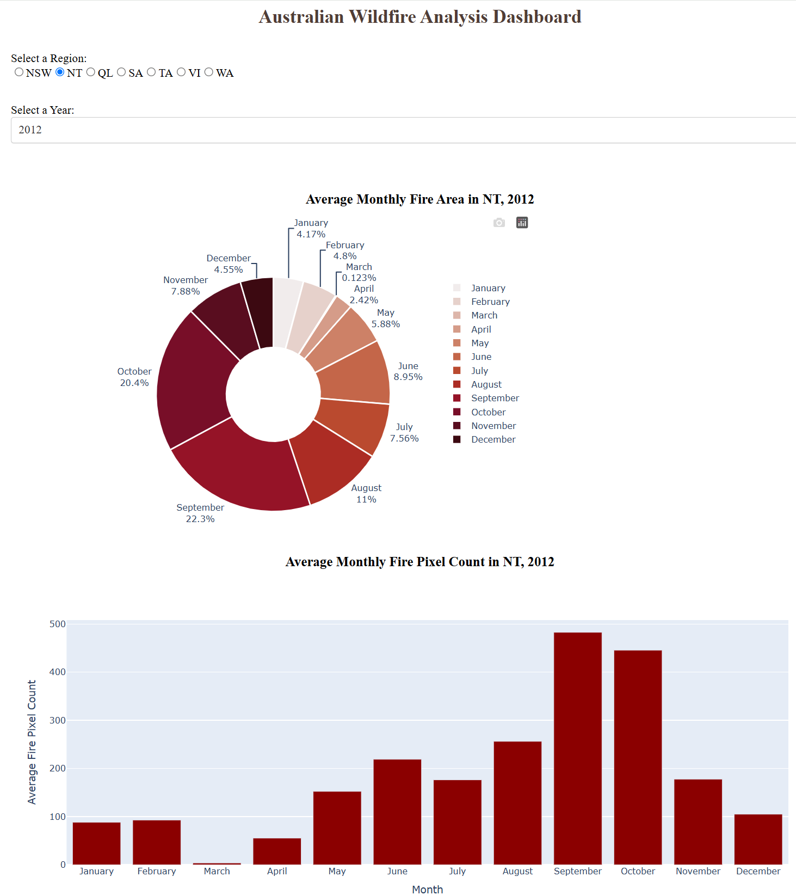
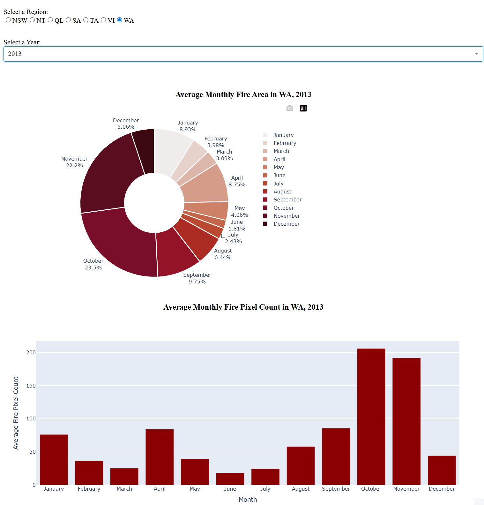

# Australian Wildfire Analysis with Data Visualization & Dashboard

This project explores historical wildfire activity across Australia using both static and interactive visualizations. The goal is to uncover regional patterns, seasonal peaks, and historical anomalies in fire activity using a combination of data exploration and dashboard interactivity.

The dataset contains fire detection records across seven Australian regions, with attributes including estimated fire area, brightness, radiative power, detection confidence, and pixel count. The analysis spans from 2005 onward.

The project is divided into two parts:
- A **Jupyter Notebook** with exploratory data analysis (EDA) and static visualizations
- A **Dash application** for interactive exploration by region and year


## Project Highlights

- Cleaned and explored satellite-based wildfire detection data across 7 Australian regions
- Conducted EDA to identify seasonal patterns and historical outliers (notably 2012)
- Built a series of static plots using `pandas`, `seaborn`, `matplotlib`, and `folium`
- Created a responsive Dash app with dropdown and radio inputs to compare:
  - Monthly average estimated fire area
  - Monthly average fire pixel count


## Key Insights

- Fire activity in Australia peaks between **August and November**, with notable intensity in **2012**
- The **Northern Territory, Western Australia, and Queensland** account for the highest fire pixel counts
- Fire brightness is generally consistent across regions, with slight variations
- Satellite detection confidence remains high even for lower-radiative-power fire events


## Repository Structure

```
australian-wildfire-dashboard/
├── app/
│   └── wildfire_dashboard.py         # Dash app script
├── data/
│   └── wildfire_data.csv             # Local dataset (not tracked in repo)
├── notebooks/
│   └── wildfire_visual_analysis.ipynb # Main EDA notebook
├── images/                           # Screenshots used in README
├── requirements.txt
└── README.md
```


##  Sample Visuals

### Jupyter Notebook


*Monthly fire area over time reveals 2012 as a historic peak.*


*Interactive map showing fire pixel distribution across Australian regions.*

### Dash App


*Interactive dashboard with inputs for region and year.*


*Dashboard view for Western Australia in 2013.*


## Launch the Dashboard

To run the dashboard locally:

```bash
cd app
python wildfire_dashboard.py
```
Then open your browser to `http://127.0.0.1:8050`


## Dataset

This dataset is based on publicly available satellite-based wildfire detection data from Australia. A local copy (`wildfire_data.csv`) is used for reproducibility.

---

This project is part of a broader portfolio showcasing practical applications of data science across analytics, visualization, and machine learning.  
For more projects, visit [My GitHub Portfolio](https://github.com/J1111-dotcom).

